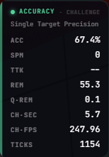
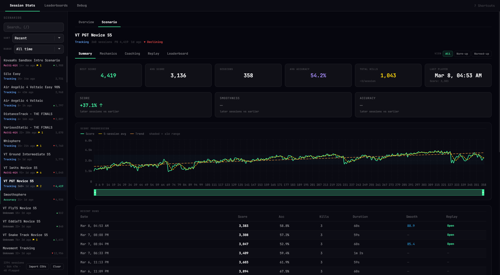
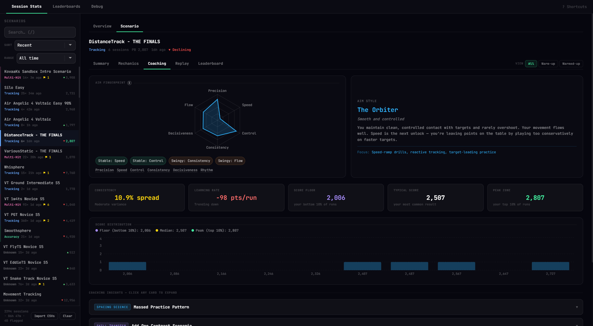
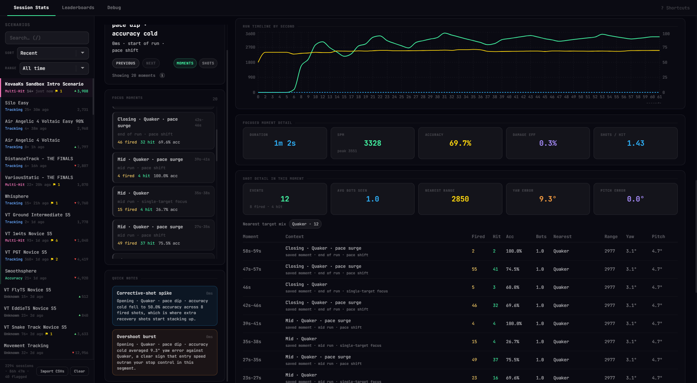
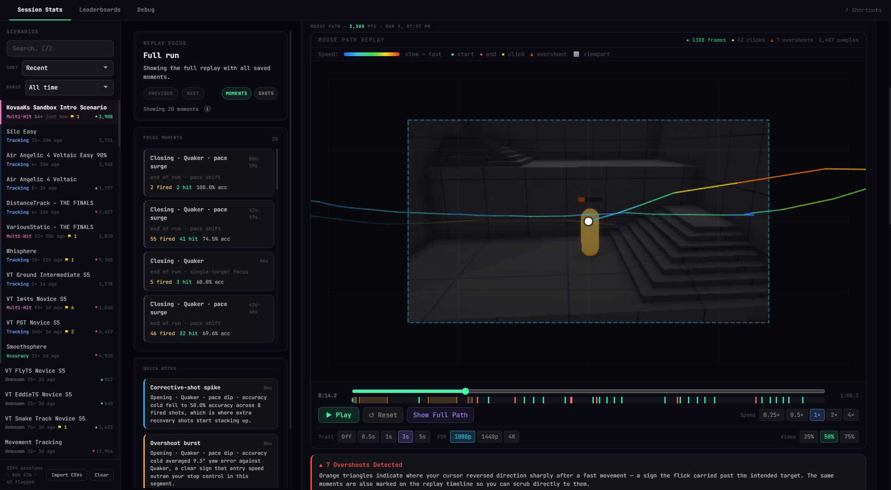

# AimMod

AimMod is a live overlay, replay, and coaching suite for KovaaK's Aim Trainer.

It is built around two parts:
- a live in-session HUD while you play
- a full post-session stats window for replay review, coaching, and scenario analysis

AimMod runs as a Windows desktop app and syncs its runtime into KovaaK's while the app is open, so your overlay, replay data, and session analysis stay tied to the same run.

## Screenshots

**Live challenge HUD**



**Scenario summary page**



**Scenario coaching page**



**Focused replay moment**



**Full-run replay review**



## What AimMod Does

### In-game overlay

- Live challenge HUDs for score, timing, pace, accuracy, and scenario state
- Smoothness and mouse-control feedback during runs
- Coaching toasts and a post-session overview
- Drag-and-scale HUD layout mode with saved positions

### Session stats

- Global overview of all your recent practice
- Per-scenario pages for summary, mechanics, coaching, replay, and leaderboard views
- Practice profile and scenario comparison tools
- SQL-backed session history and replay persistence

### Replay analysis

- Mouse path replay for the full run or selected moments
- Saved focus moments, quick notes, and replay navigation
- Timeline-by-second review
- Shot detail context for replay segments
- Video replay capture alongside the mouse path

### Coaching and profiling

- Aim fingerprint and aim-style summaries
- Warm-up and practice-pattern insights
- Scenario-specific coaching cards
- Trend, floor, peak-zone, and consistency views

### Integration

- Discord Rich Presence
- UE4SS-based runtime bridge into KovaaK's
- Automatic stats import from KovaaK's run results

## Quick Start

1. Download the latest build from [Releases](https://github.com/veryCrunchy/kovaaks/releases/latest).
2. Launch AimMod.
3. Start KovaaK's.
4. Open settings if you want to choose which HUDs are visible or reposition them.
5. Play a scenario.
6. Open the stats window to review the run, replay key moments, and inspect scenario-specific coaching.

### Default hotkeys

| Key | Action |
| --- | --- |
| `F8` | Open settings |
| `F10` | Toggle HUD layout mode |

## Requirements

- Windows 10 or Windows 11
- KovaaK's Aim Trainer (Steam)
- AimMod running while you play if you want live overlay, replay capture, runtime bridge data, and automatic session analysis

## Build From Source

### Frontend

```bash
pnpm install
pnpm run build:frontend
```

### Windows app

```bash
pnpm run build:win:dev
```

Release build:

```bash
pnpm run build:win
```

## One-command pipeline

The repo includes a full pipeline that builds:
- `ue4ss-rust-core`
- `ue4ss-mod`
- the staged UE4SS runtime payload
- the Tauri Windows app

Windows / PowerShell:

```powershell
pnpm run pipeline:win
```

Windows dev stripped build:

```powershell
pnpm run pipeline:win:dev:stripped
```

WSL / Linux dev stripped build:

```bash
pnpm run pipeline:wsl:dev:stripped
```

WSL / Linux release stripped build:

```bash
pnpm run pipeline:wsl:release:stripped
```

## Repo Notes

- The overlay frontend lives in `src/`
- The Tauri backend lives in `src-tauri/`
- The UE4SS mod lives in `ue4ss-mod/`
- Runtime payload staging scripts live in `scripts/`
