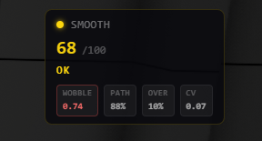
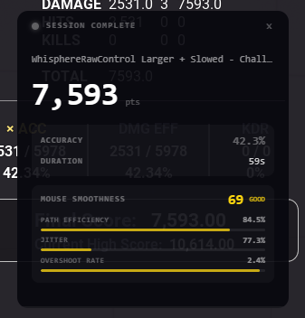
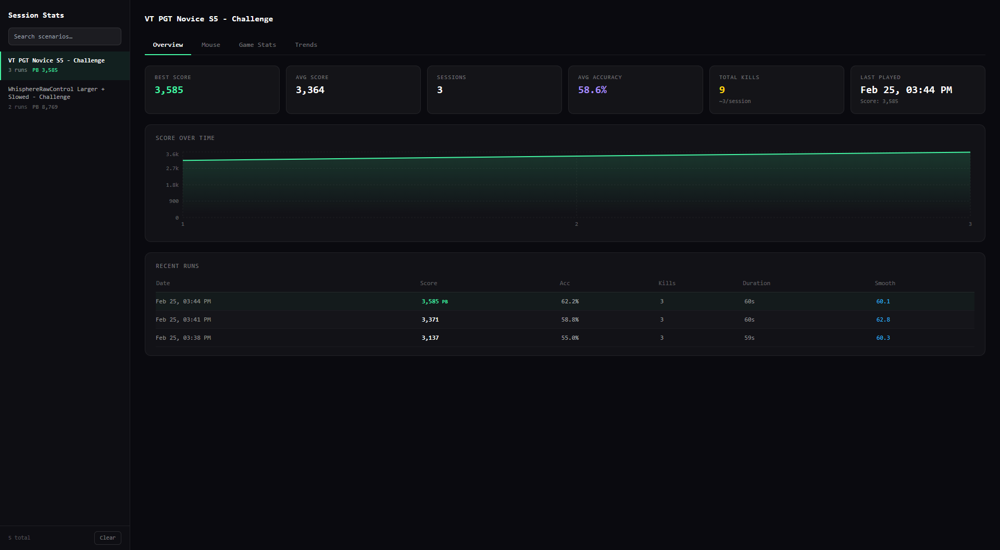
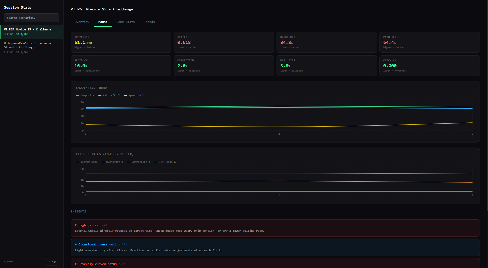
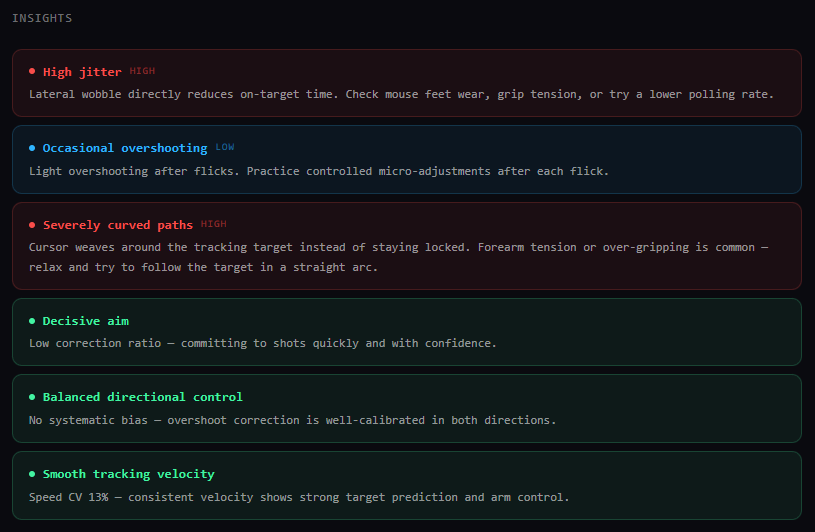
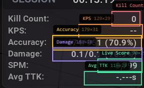

# AimMod

Your personal KovaaK's coach — AimMod for KovaaK's Aim Trainer.

> AimMod runtime is injected when AimMod starts

---

## Screenshots

**Smoothness HUD — live score, rating, and mouse metrics**



**Post-session popup — final score, accuracy, and smoothness summary**



**Session stats — overview tab (score over time, recent runs)**



**Session stats — mouse tab (smoothness trend, error metrics, insights)**



**Insights panel — actionable coaching tips based on your mouse data**



**Region picker — each stat field needs its own region drawn around it in KovaaK's**



---

## Demo

<!-- demo gif / video here -->

---

## Features

- **VS Mode** — live score bar vs a friend's personal best fetched from the KovaaK's API. Your score is projected against their pace in real time; final delta shown after the session
- **Stats HUD** — per-field OCR reads kills, accuracy, and other stats directly from regions you define around the in-game UI
- **Smoothness HUD** — real-time mouse smoothness score (0–100), jitter, and overshoot from a global OS mouse hook; DPI-normalised so it's comparable across sensitivity setups
- **Live coaching tips** — auto-dismissing toast notifications during sessions based on your mouse metrics and stats; three verbosity levels
- **Post-session overview** — auto-detected from KovaaK's results CSV; shows final score, accuracy, and smoothness summary
- **Smoothness report** — full post-session graphs: velocity curve, jitter histogram, overshoot rate, and actionable advice
- **Friend manager** — search and add friends by KovaaK's username; profiles and most-played scenarios fetched from the KovaaK's public API
- **Layout mode** — press F10 to drag and scale every HUD independently; positions and scales persist across restarts
- **Per-HUD visibility** — toggle VS Mode, Smoothness, Stats Panel, Coaching Tips, and Post-Session overview individually
- **Multi-monitor** — pick which monitor AimMod covers

---

## Installation

Download the latest installer from the [Releases](https://github.com/veryCrunchy/kovaaks/releases/latest) page and run it.

**Requirements:** Windows 10/11 · KovaaK's installed via Steam

---

## Quick start

1. Install and launch the app
2. Right-click the system tray icon → **Open Settings**
3. Set your **KovaaK's username** and pick your **AimMod Display**
4. Click **Pick Region** to draw a box around the live score number in KovaaK's
5. Optionally add a friend under **Friends** and set them as your battle opponent
6. Play — AimMod is fully click-through

**Hotkeys**

| Key | Action |
|-----|--------|
| F8 | Toggle Settings panel |
| F9 | Jump to region picker |
| F10 | Toggle HUD layout mode (drag / resize) |

---

## Building from source

```bash
# Prerequisites: Rust stable, Node.js ≥ 18, pnpm
pnpm install
pnpm tauri build
```

Cross-compiling from Linux/WSL2 to Windows (uses cargo-xwin):

```bash
pnpm build:win
```

## One-command dev pipeline

Target is always **Windows x64** (`x86_64-pc-windows-msvc`), with host support on Windows or WSL/Linux.

Full setup + build + AimMod runtime payload staging can be run with:

Windows / PowerShell:

```powershell
pnpm run pipeline:win
```

Linux / WSL:

```bash
pnpm run pipeline:wsl
```

WSL/Linux release attempt:

```bash
pnpm run pipeline:wsl:release
```

The pipeline will:

1. Ensure Rust target/tooling (`cargo-xwin`) is installed
2. Build `ue4ss-rust-core` (`kovaaks_rust_core.dll`)
3. Build `ue4ss-mod` (`main.dll`)
4. Use curated runtime from `external/ue4ss-runtime/current` if present, otherwise extract ZIPs from `external/ue4ss-runtime` (or use `--runtime-dir`)
5. Stage payload into `src-tauri/ue4ss`
6. Build the Tauri Windows app

Default staging uses a **minimal AimMod runtime profile**:
- core runtime binaries + managed settings
- generic template/signature folders (`VTableLayoutTemplates`, `MemberVarLayoutTemplates`, signatures)
- only the AimMod runtime package (`Mods/KovaaksBridgeMod`) + `kovaaks_rust_core.dll`
- generated runtime manifest enabling only `KovaaksBridgeMod`
- production settings template (`GraphicsAPI=dx11`, `EngineVersionOverride=4.27`, debug tooling off)

Optional dev build variants:

```powershell
pnpm run pipeline:win:dev
```

```bash
pnpm run pipeline:wsl:dev
```

Notes:

- `pipeline:wsl` defaults to a Windows **dev** app build (`--no-bundle`) for highest reliability on Linux hosts.
- On WSL, only the native C++ runtime compile is delegated to Windows MSVC (`powershell.exe`); Rust/payload/orchestration stay in Bash.
- Runtime staging profile can be switched with `--runtime-profile full` (default is `minimal`).
- Curated runtime location can be overridden with `--runtime-local-dir`.
- Dev pipeline scripts keep the native runtime build in `Release` by default (to avoid Debug CRT dependencies in-game). Override with `--mod-configuration Debug` if needed.
- On non-WSL Linux, missing `mingw-w64` is installed automatically by the pipeline.
- WSL pipeline auto-generates the native import library from runtime exports (from `external/ue4ss-runtime`) so native runtime linking does not require rebuilding external runtime sources.
- If you explicitly want MinGW native runtime compilation on WSL, use `scripts/dev-pipeline.sh --force-mingw-mod-build` (not recommended for SDK compatibility).
- `fmt` headers are auto-resolved in CMake (uses vendored runtime SDK copy if present, else fetches upstream headers).
- `pipeline:win` builds the full Windows release installer path.
- SDK path is auto-detected from `external/` (prefers `external/ue4ss-cppsdk`, then template SDK fallbacks).
- If the template SDK checkout is present but missing nested dependencies, the pipeline attempts `git submodule update --init --recursive` automatically.
- Native C++ runtime builds require private Unreal headers (`UEPseudo`) via Epic-linked GitHub access.
- You can still override the SDK path manually via environment variable or with `--ue4ss-sdk-dir` on the script.
- Incremental cache is enabled by default (`.cache/pipeline`) and skips unchanged steps (`pnpm install`, rust core build, native runtime build, staging, app build).
- Use `--no-cache` to force all steps, or `--clear-cache` to wipe cache keys.

| Command | Description |
|---------|-------------|
| `pnpm tauri dev` | Dev server + Rust hot-reload (Linux/WSL2, mock OCR) |
| `pnpm build:win:dev` | Fast dev build for Windows (no LTO, incremental) |
| `pnpm build:win` | Full release build for Windows (LTO, stripped) |
| `pnpm check` | Fast Rust type-check on Linux host |

---

## AimMod Runtime Payload Staging

Before building a release installer, stage the runtime payload into `src-tauri/ue4ss`:

PowerShell (Windows):

```powershell
pwsh ./scripts/sync-ue4ss-payload.ps1 `
  -RuntimeDir "<extracted-ue4ss-runtime-dir>" `
  -ModMainDll "<path-to-main.dll>" `
  -RustCoreDll "<path-to-kovaaks_rust_core.dll>" `
  -RuntimeProfile minimal
```

Linux / WSL (Bash):

```bash
./scripts/sync-ue4ss-payload.sh \
  --runtime-dir "<extracted-ue4ss-runtime-dir>" \
  --mod-main-dll "<path-to-main.dll>" \
  --rust-core-dll "<path-to-kovaaks_rust_core.dll>" \
  --runtime-profile minimal
```

---

## Runtime model

On startup, AimMod:

- Syncs bundled runtime payload files into KovaaK's `Binaries/Win64`
- Injects the runtime so `KovaaksBridgeMod` loads
- Streams runtime events over a named pipe to the AimMod backend

If AimMod is not running, runtime hooks are not injected/loaded.
